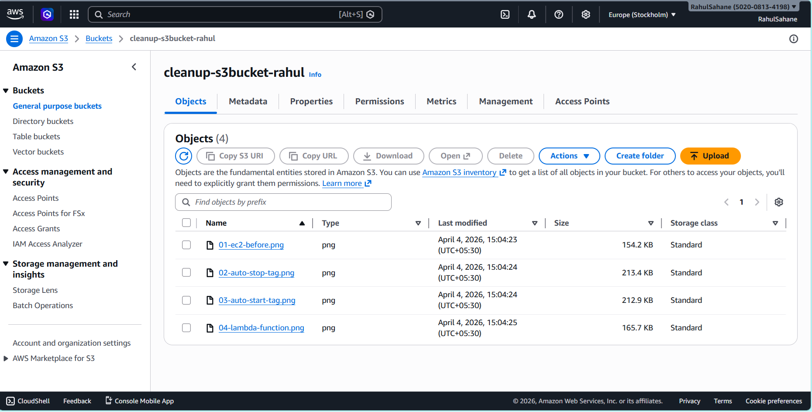
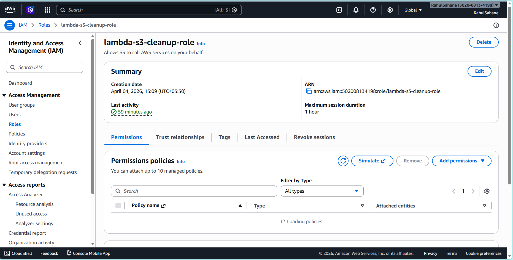
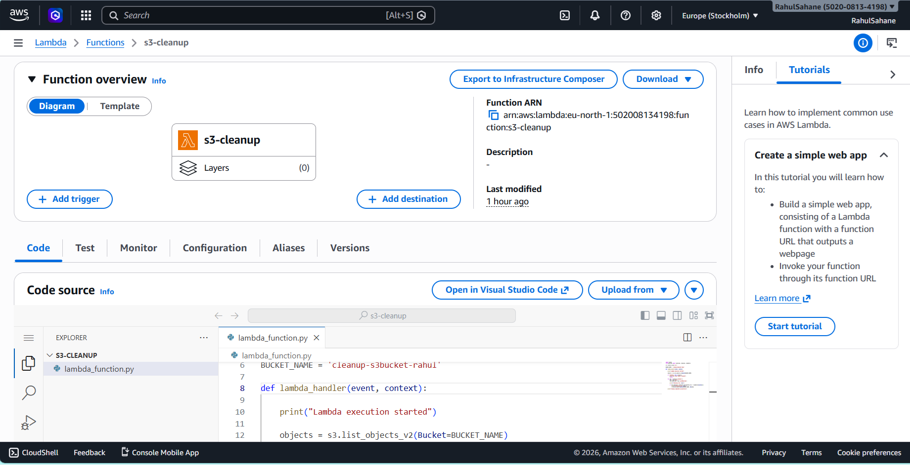

# Assignment 2: Automated S3 Bucket Cleanup Using AWS Lambda

---

##  Objective
Automate the cleanup of old or unused files in an Amazon S3 bucket using AWS Lambda and Boto3.

---

##  Services Used
- AWS S3  
- AWS Lambda  
- AWS IAM  
- Boto3 (Python SDK)  

---

## Implementation Steps

### Step 1: S3 Bucket Setup
Created an S3 bucket named **cleanup-s3bucket-rahul** and uploaded multiple files for testing the cleanup process.

# Screenshot:  


---

### Step 2: IAM Role
Created an IAM role named **lambda-s3-cleanup-role** with required permissions.

- Policy Attached: AmazonS3FullAccess  

# Screenshot:  


---

### Step 3: Lambda Function
Created a Lambda function using Python runtime and attached the IAM role.

- Function Name: **s3-cleanup**  
- Runtime: Python 3.x  

# Screenshot:  


---

### Step 4: Lambda Code
Implemented Boto3 code to:

- List objects from the S3 bucket  
- Check last modified date  
- Delete files older than defined time  

# Screenshot:  


---

## Code

```python
import boto3
from datetime import datetime, timezone, timedelta

s3 = boto3.client('s3')

BUCKET_NAME = 'cleanup-s3bucket-rahul'

def lambda_handler(event, context):
    
    print("Lambda execution started")

    objects = s3.list_objects_v2(Bucket=BUCKET_NAME)

    if 'Contents' not in objects:
        print("No files found in bucket")
        return

    for obj in objects['Contents']:
        key = obj['Key']
        last_modified = obj['LastModified']

        print(f"Checking file: {key}")

        if last_modified < datetime.now(timezone.utc) - timedelta(minutes=1):
            print(f"Deleting file: {key}")
            s3.delete_object(Bucket=BUCKET_NAME, Key=key)

    print("Cleanup completed successfully")

### Step 5: Execution Result

Executed the Lambda function manually using the Test event.

The logs show:

- Lambda execution started  
- Files being checked  
- Files being deleted  
- Cleanup completed successfully  

# Screenshot:  


---

### Step 6: Result

After execution:

- All files were successfully deleted  
- S3 bucket is empty  

# Screenshot:  
!
[S3 Bucket After Cleanup](screenshots/06-s3_bucket_after_cleanup.png)

# Note

For testing purposes, the time condition was set to:

timedelta(minutes=1)

Instead of:

timedelta(days=30)

In real-world scenarios, 30 days should be used.

# Conclusion

This assignment demonstrates how AWS Lambda and Boto3 can be used to automate S3 bucket cleanup, helping in cost optimization and efficient storage management.

Author:
Rahul Sahane

